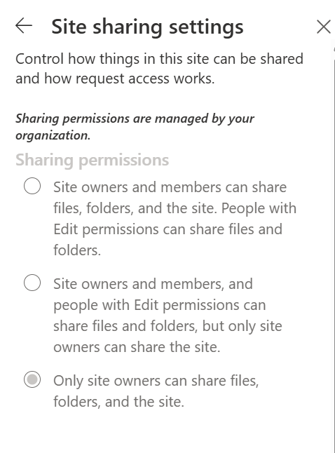

> **TL;DR:** If you are locking down Teams/SharePoint sharing for Copilot readiness, `MembersCanShare="MemberShareNone"` is a great control. The write operation can be done via `Set-Label` using **either** `-AdvancedSettings` or `-Settings`. The read-back that matters is the label’s **`Settings`** property. The confusing part is the cmdlet parameter naming — not a “new” change in ExchangeOnlineManagement.

## Why this matters (especially with Copilot)

Default sharing behavior in Microsoft 365 collaboration spaces is often generous. In a Copilot world, that generosity becomes a governance gap: Copilot will surface what people already have access to. Overshared content becomes AI-discoverable content.

At **Atea**, this is part of how we help customers prepare for Copilot: apply secure-by-default collaboration controls at creation time (not as a post-provisioning cleanup exercise).

---

## Proof: the label enforces sharing (screenshot)

Below is the real-world result after creating a Team with the **Secure Team** container sensitivity label. SharePoint shows that **sharing permissions are managed by your organization**, and the options are greyed out — confirming the label is enforcing the setting.



*Label-enforced site sharing: Users cannot override sharing permissions. (`MembersCanShare = MemberShareNone`)*

> **Hugo note:** This uses a **relative** image link so it works both locally and on GitHub Pages with a subpath.

---

## The goal

I wanted a container sensitivity label that:

- Forces the Team to **Private**
- Blocks guest access
- Restricts external sharing
- Ensures **only site owners can share** files, folders, and the site

The last requirement is a SharePoint site-sharing control that can be enforced via the sensitivity label’s **MembersCanShare** setting.

---

## The original confusion (and the corrected explanation)

I initially framed my troubleshooting as if **ExchangeOnlineManagement 3.9.x** changed where these values are stored.

That framing was wrong.

The more accurate explanation is:

1. The `Set-Label` cmdlet supports both `-AdvancedSettings` and `-Settings` parameters. Microsoft Learn shows both in the syntax.  
2. These parameters can write values into the same underlying label configuration (“settings blob”). (This behavior is widely observed and discussed by the community, and aligns with how the cmdlet is structured.)  
3. When you read the label back with `Get-Label`, the canonical place to look for key/value settings is the label’s **`Settings`** property.

**Net result:**

- It’s easy to think “nothing saved” if you only check the wrong property.
- The real issue is **inconsistent naming and documentation patterns**, not necessarily a new module behavior.

---

## MembersCanShare values (quick reference)

| Sharing posture | Value |
|---|---|
| Owners & members can share everything | `MemberShareAll` |
| Members can share files/folders, only owners share the site | `MemberShareFileAndFolder` |
| **Only owners can share files/folders/site** | `MemberShareNone` |

---

## Working configuration (copy/paste)

### 1) Create the label

```powershell
Connect-IPPSSession

New-Label -DisplayName "Secure Team" \
  -Name "SecureTeam" \
  -Tooltip "Private team with restricted sharing (owners only)" \
  -ContentType "Site, UnifiedGroup"

$labelId = (Get-Label -Identity "SecureTeam").Guid.ToString()
```

### 2) Configure container behavior (privacy + guests)

> Note: `-LabelActions` expects JSON.

```powershell
Set-Label -Identity $labelId -LabelActions '{"Type":"protectgroup","SubType":null,"Settings":[{"Key":"privacy","Value":"private"},{"Key":"allowemailfromguestusers","Value":"false"},{"Key":"allowaccesstoguestusers","Value":"false"},{"Key":"disabled","Value":"false"}]}'
```

### 3) Configure SharePoint sharing restrictions (owners only)

You can set this using `-AdvancedSettings` (commonly documented):

```powershell
Set-Label -Identity $labelId -AdvancedSettings @{MembersCanShare="MemberShareNone"}
```

Or you can set it using `-Settings` (also supported by the cmdlet syntax):

```powershell
Set-Label -Identity $labelId -Settings @{MembersCanShare="MemberShareNone"}
```

Both parameters exist in the official cmdlet syntax. 

### 4) Verify (the part that trips people up)

```powershell
$label = Get-Label -Identity $labelId

# The reliable verification view:
$label.Settings

# Optional: pull just one key
$label.Settings["MembersCanShare"]
```

If you see `MemberShareNone`, the label is configured correctly.

### 5) Publish the label

```powershell
New-LabelPolicy -Name "Secure Team Policy" \
  -Labels $labelId \
  -Comment "Publishes Secure Team container label" \
  -ExchangeLocation "All"
```

---

## Key takeaways

1. **Secure-by-default sharing matters more with Copilot** because AI surfaces what is already accessible.
2. `MembersCanShare="MemberShareNone"` is a practical control to reduce oversharing.
3. `Set-Label` supports both `-AdvancedSettings` and `-Settings` parameters.
4. Don’t confuse the cmdlet parameter name with the property you should verify — check the label’s **`Settings`**.
5. A screenshot showing greyed-out SharePoint sharing settings is the strongest proof for stakeholders.

---

## References

- Microsoft Learn (Set-Label cmdlet syntax includes **-AdvancedSettings** and **-Settings**): https://learn.microsoft.com/en-us/powershell/module/exchangepowershell/set-label?view=exchange-ps 
- Practical365 (Tony Redmond) – reporting sensitivity label settings with PowerShell: https://practical365.com/sensitivity-label-settings-report/ 

---

*This post was refined based on peer review in the community — thank you for the corrections and the healthy skepticism. That’s how we all get better.*

*Troubleshooting and writing supported by Microsoft 365 Copilot — my AI pair-debugger for the afternoon.*
